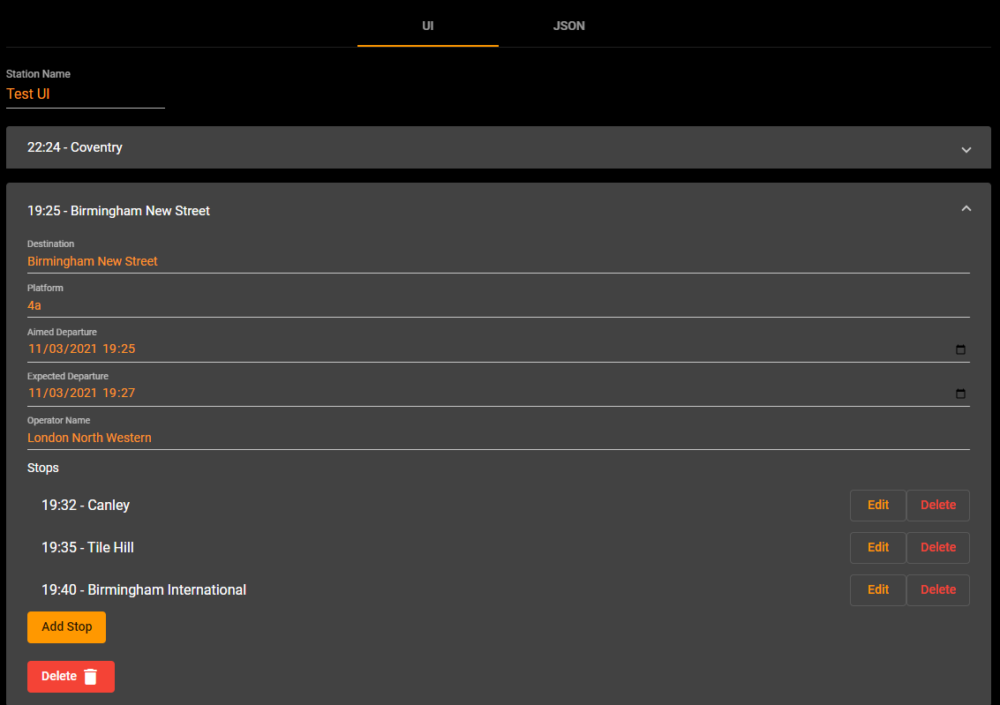

A brand new feature has been released that will allow you to build custom departures using a UI builder.
Before you would need to manually build a json file, which was complex and easy to get wrong.

The new feature allows you to quickly build a set of custom departures without having any technical knowledge.

<!--truncate-->

Once you have configured you custom departure set. Then you can simply click `View` to see the departures in the normal main board view.

We are excited in making our system more user friendly an value any user [feedback](https://github.com/benfl3713/DepartureBoard/issues)

> To get started, head of to <https://leddepartureboard.com/custom-departures> and login with your google account, to create custom departures.
