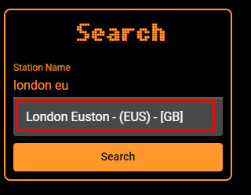

Led Departure Board is a webapp designed to re-create the departure signs
you get at uk and German train stations. The data is collected live from
various sources and displayed in custom panels.

## Welcome

This website holds a vast library of documentation on how to use [www.leddepartureboard.com](https://www.leddepartureboard.com).  
Use the sidebar to navigate through the documents, or use the search bar to find something specific.

## Viewing a station

1. To view a station first go to the [search page](https://www.leddepartureboard.com/search)
2. Search for any station of choice, E.g London Euston
3. Click on the autocomplete of the station you have searched for  
   
4. Finally click the orange search button to go to the station you have selected

---

:::tip Tip
See the [Board Types](board-types/mainboard.mdx) section on how to use the various different boards
:::
